# ReadMe - Pony Game
This is a React application, which interfaces with the [Pony Panic API](https://ponypanic.io/), calculates and submits the actions of the hero character.

## Table of Contents

- [ReadMe - Pony Game](#readme---pony-game)
  - [Table of Contents](#table-of-contents)
  - [Installation](#installation)
  - [Overview](#overview)
    - [First steps](#first-steps)
    - [Heat Map](#heat-map)
    - [Automatic actions](#automatic-actions)
    - [Weight values](#weight-values)
    - [Conclusion](#conclusion)
  - [Project Structure](#project-structure)
    - [Root](#root)
    - [Pony Pathfinder](#pony-pathfinder)
      - [components](#components)
      - [api](#api)
      - [logic](#logic)

---

## Installation
To build the project, run:
```
$ npm run build
```

Once the project is built, start the project with:
```
$ npm start
```

If everything went well, the application should be available at http://localhost:8081/

Please make sure to access the application via the `localhost` URL, otherwise the [Pony Panic API](https://ponypanic.io/) will refuse the requests sent to it.

---

## Overview

### First steps

Please open your web browser, and navigate to the application at http://localhost:8081/ . You should be greeted with a User Interface (UI) similar to the one below:

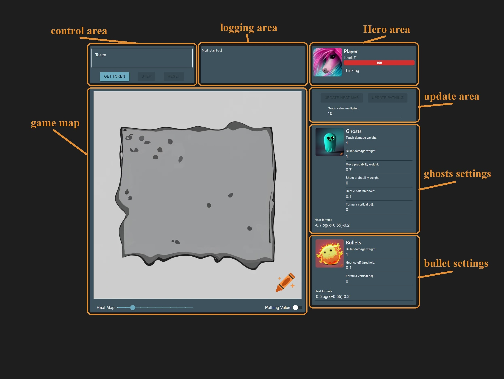

To start the game, click on the `GET TOKEN` button inside the `control area`, and retrieve a token.

If clicking the button doesn't work, please navigate to the [Pony Panic API](https://ponypanic.io/).

Once on the [Pony Panic API](https://ponypanic.io/) page, click the `NEW GAME` button, as shown below:

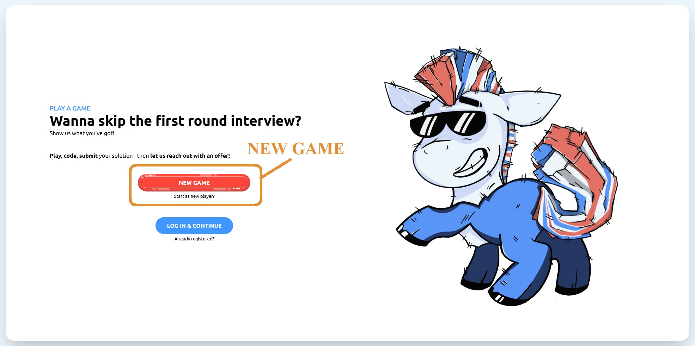

Once a new game has started, you should see a `SHOW TOKENS` button on the side panel to the right side of the game map. Please click this button to reveal the tokens, and copy the **Story Playthrough Token** like this:

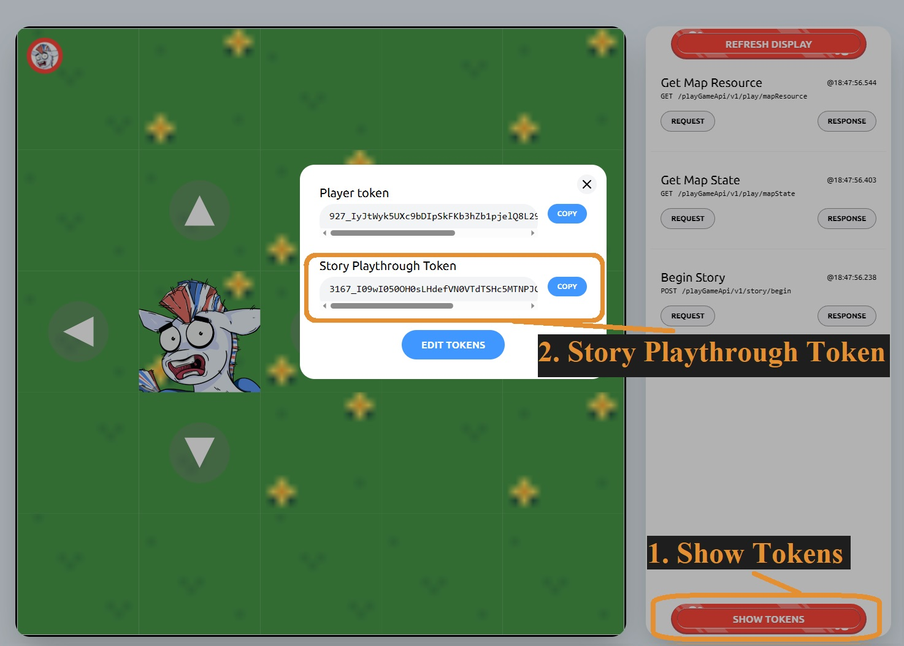

Once copied, you can now return to the web application, and paste the **Story Playthrough Token** into the Token text input field inside the the control area. If the token was successfully pasted, the UI should change to reveal a `Play`, `Step` and a `Reset` buttons.

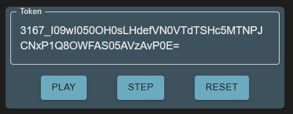

Pressing the `Play` button will start the game, where the application will continuously calculate the next action of the Hero character, and send it to the Pony Panic API.

Alternatively, pressing the `Step` button will make the application perform only the next "task" in a series of pre-defined tasks.

Please feel free to play the game, using either with the `Play` or the `Step` buttons, until you reach the 3rd level, as indicated by the `Hero area`, below the word: **Player**.

---

### Heat Map

On the 3rd level, you should be faced with the first enemy, a ghost.

This is what the map should look like, if you click the `Step` button, until the `logging area` displays the text: **Calculating hero path**:

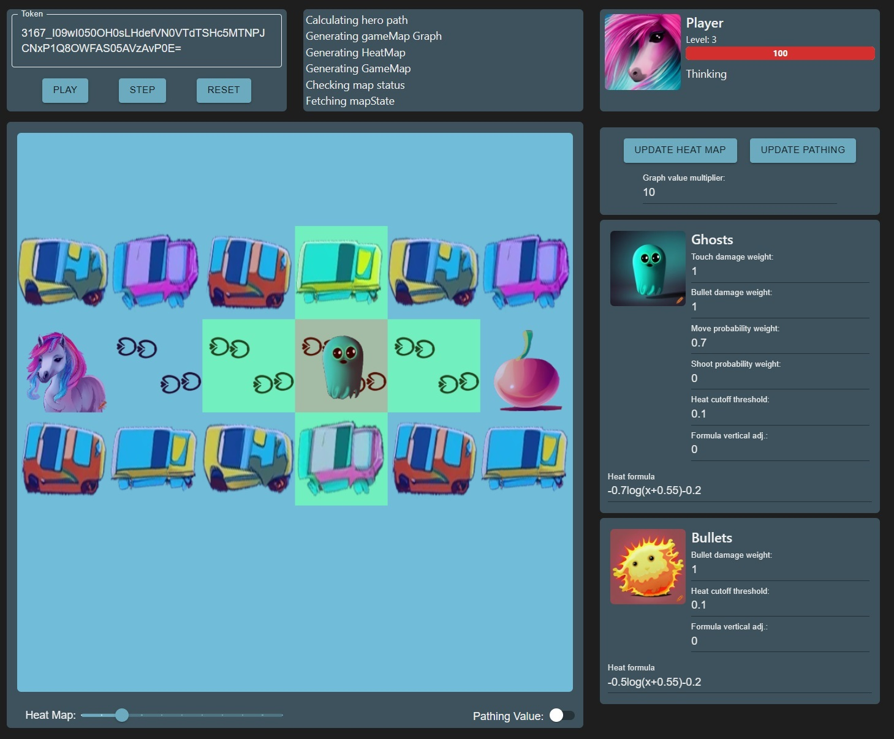

In the game, each opponent is a heat source, contributing to the generation of a `Heat Map`. The `Heat Map` is essential for guiding the path of the Hero character.

By default, every opponent produces a heat value that is normalized to a range between 0 and 1. These heat values, along with their weights, are used to calculate the **Pathing Value**. The **Pathing Value** determines the cost of a path.

For now however, let's turn our attention to the **Heat formula** field inside the `ghost settings` panel.

The **Heat formula** defines how the heat value will spread to the neighboring tiles. Let's experiment a little with the **Heat formula** and change the default value to `-2log(x+0.55)-0.2`.

After changing the formula, let's click on the **UPDATE HEAT MAP** button, to re-calculate the heat map with the new formula.

We can immediately see that the heat expanded more with the new formula. To get a better understanding of the distribution of the heat values, we can toggle on the **Pathing Value** option located at the bottom right of the game map:

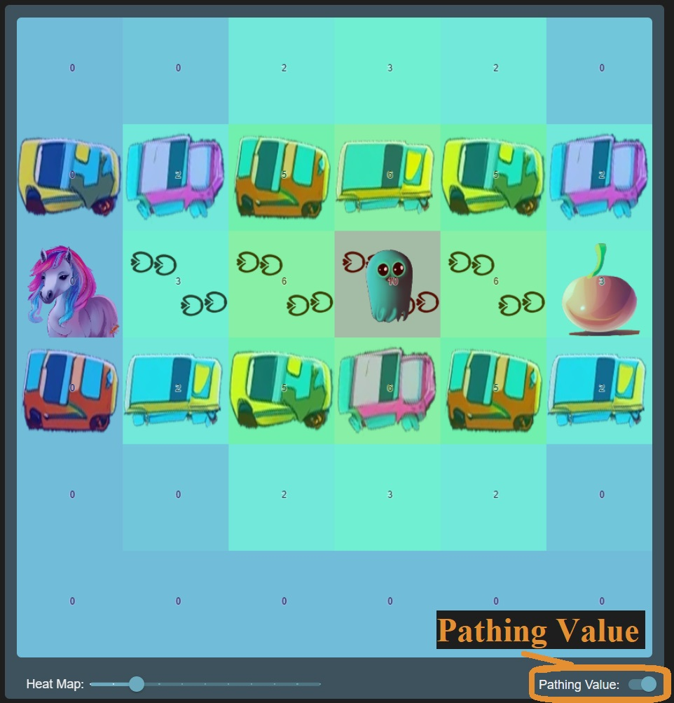

With the **Pathing Value** toggle turned on, we can even calculate the cost of reaching the fruit

`3 + 6 + 10 + 6 + 3 = 28`

These values are derived from the `Heat Map`, and are used by the algorithm responsible for finding the "shortest path" to the nearest fruit.

If there was another fruit which we could reach with a lower travel cost, the game's algorithm would have chosen that fruit instead.

The algorithm used for finding the shortest path to an object is called [Dijkstra's algorithm](https://en.wikipedia.org/wiki/Dijkstra%27s_algorithm). Fortunately, there is an npm library available [here](https://www.npmjs.com/package/dijkstrajs), which implements Dijkstra's algorithm.

The application generates the `Heat Map` based on the formula and some other values. Then, it generates a graph of the map, where the pathing values are used as the edge cost. Once the graph is finished, Dijkstra's algorithm returns the path to the destination with the lowest cost.

Now, let's take a look at another value, the **Heat cutoff threshold** located inside the `ghost panel`. This value is used by the heat map generator function. If the heat value inside a cell is lower than the **Heat cutoff threshold**, its neighboring cells will not have a heat value calculated.

By increasing the **Heat cutoff threshold** value, the heat map will spread out less. Please note that the heat values are always normalized to be between 0 and 1, even if the pathing values exceed that range.

This is the effect of setting the **Heat cutoff threshold** to 0.6:

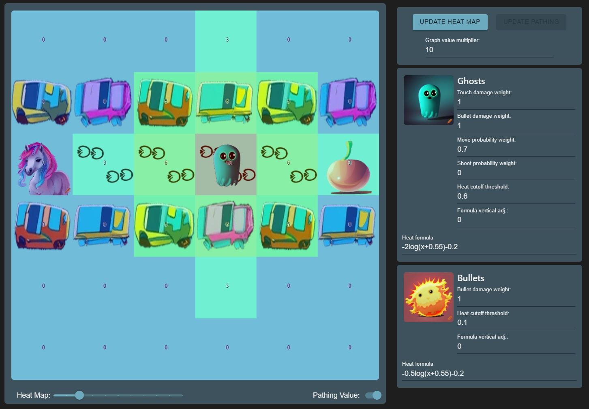

Another **Heat formula** worth trying out is the **Gaussian distribution** formula: `(1/σ*sqrt(2*PI))*e^(-(x+μ)^2/(2*σ)^2)`. Make sure to substitute values for **σ** and **μ**.

This Gaussian distribution formula worked well for me: `(1/0.05*sqrt(2*PI))*e^(-(x+0)^2/(2*0.05)^2)`.

However, it takes longer to compute the heat values with this formula. After substituting some values, we can arrive at a computationally cheaper approximation: `50*2.7^(-x^2/0.01)`

---

### Automatic actions

Some of the hero's actions are controlled by simple `if` statements. Unfortunately, these are not exposed as of yet.

To summarize quickly, the hero character will decide against moving under these circumstances:

- If an enemy is blocking the hero's path and is 2 tiles away, the hero will choose to attack instead of moving.
- If there is a bullet in the intended movement path of the hero, the hero will use the shield ability to protect herself.
- If a bullet is approaching the hero while the hero is moving towards it and they are 2 tiles away, the hero will use the shield ability.
- If a bullet is moving perpendicular to the hero's path and both the bullet and the hero would end up on the same tile, the hero will use shield instead.

These behaviors a defined in the `src/features/ponySolver/util/getHeroAction.ts` file.

As we progress in the game, we will observe that the move action will be replaced by the attack action once the hero gets close enough to the enemy:

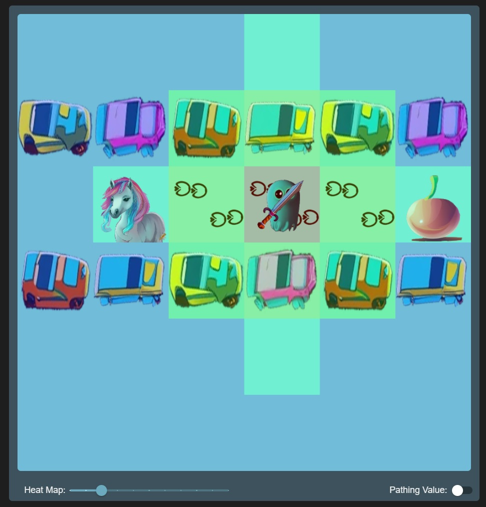

Let's advance the game until we reach **Level 7**

---

### Weight values

We have discussed the **Heat formula** and the **Heat cutoff threshold** which influence how the `Heat Map` is generated.

Now with multiple ghost enemies present, we can experiment with setting the weight value of each of the ghosts characteristics. Since the heat values are normalized to be between 0 and 1, changing the weights would not have had any noticable effect until now.

The ghost opponents have several characteristics, each of which can be assigned a weight value when calculating their base heat value. Even though this value will be normalized, it will differ from other ghosts present, allowing us to give a larger heat value to the scarier ghosts.

Let's take a look at this Level 7 map:

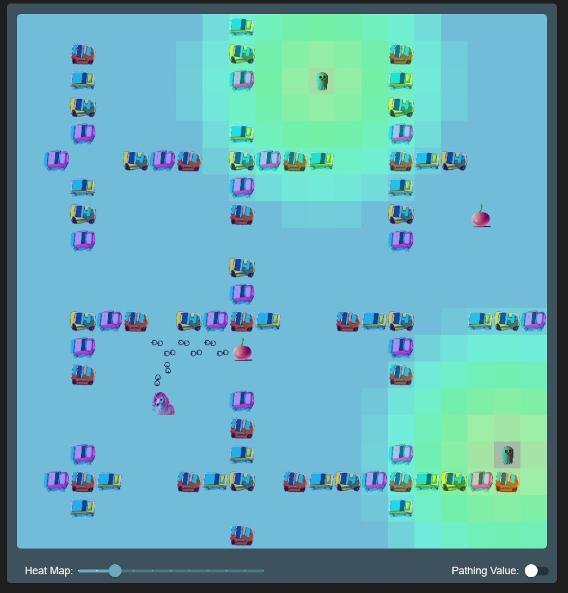

Since the appliction doesn't have those handy floating characteristics panels which [Pony Panic](https://ponypanic.io/) has, let me navigate back there, and check what values the ghosts have:

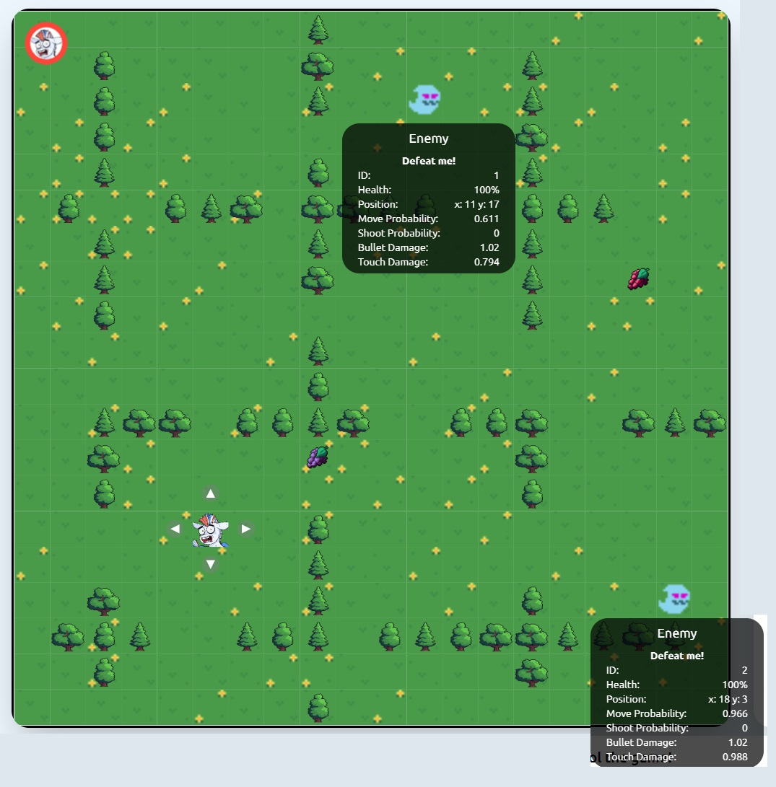

For the sake of testing, let's say that we are only interested in how much touch damage the ghosts have. Especially, since both of them has a 0 for **shoot probability**

This is the resulting heat map, after giving a weight value of 1 to the **Touch damage**:

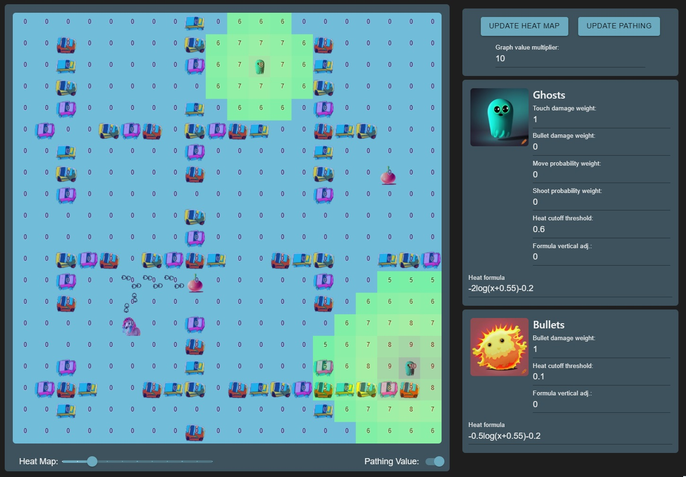

With these settings, we can see how these settings influenced the heat map and the pathing value generation. The ghost with the higher touch damage has a larger base heat value, which also radiates out further.

---

### Conclusion

Thank you for following along this introduction. I hope that you will have a good time experimenting with the application.

If you are interested more in the internal states and variables of the application, you can log the current `Redux store` to the console, by clicking on the Player's protrait.

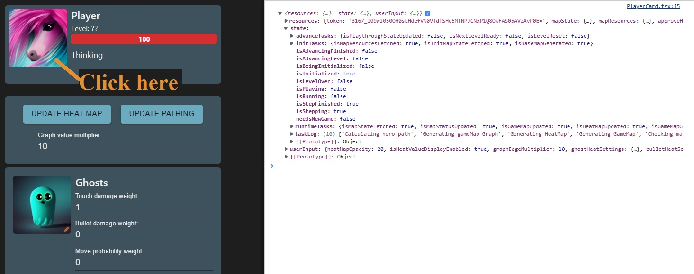

Also, a shout-out to [craiyon](https://www.craiyon.com/) for the AI generated images.

---

## Project Structure

### Root

The project is written in `TypeScript` with `React`, and bundled by `Webpack`.

Besides the configuration files, the all project files are located inside an `src` folder. This folder has four directories:

- **global**: stores source files which influence the whole project, like:
  - `redux store` initialization
  - css files which define the main theme of the project
  - a `theme provider` definition for the Material UI library
- **shared**: usually includes files which might be used by multiple **features**, like UI elements.
- **pages**: stores the root level React components which defines the single application page.
- **features**: parts of the application are grouped together here by functionality, like:
  - navigation
  - ponySolver

---

### Pony Pathfinder

Let's take a look at the main feature of this application now, the Pony Pathfinder feature.

The directory for this feature is located here: `src/features/ponySolver`

These are the folders inside:

- **api**
- **components**
- **imports**
- **initializers**
- **logic**
- **media**
- **redux**
- **styles**
- **types**
- **util**

---

#### components

Starting with the **components** folder, we can see that it includes 3 additional directories:

- **container**: React components with their own functionality.
- **hoc**: Higher Order Components, of which the main functionality is to group other components together
- **presentational**: Simple React components which mostly just display or update a value

On this image, we can see how the UI is built using these components:

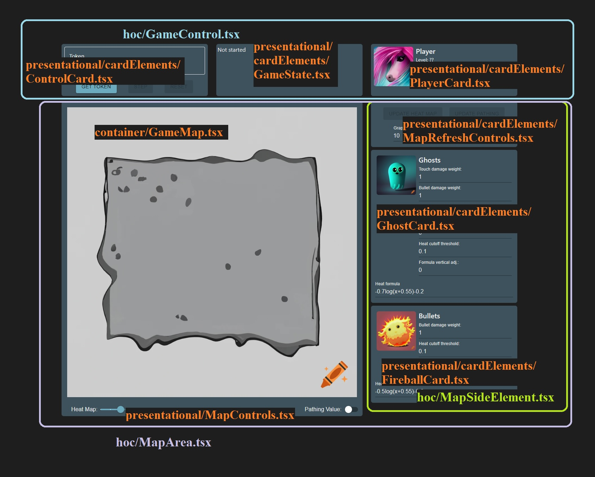

---

#### api

The **api** folder holds all requests that the application might send. These might include:
- Requesting the current MapState.
- Sending a POST request for the next level.

---

#### logic

The **logic** folder containns a single **GameSolver.tsx** file. This file exports a React component without any visual elements.

Instead, it dispatches `Redux Thunks`, which are functions instead of actions. There are three of these `Thunks`, and together, they are responsible for moving the game forward.

The **GameSolver** component is responsible for calling the right `Thunk`, based on the game's state variables.


